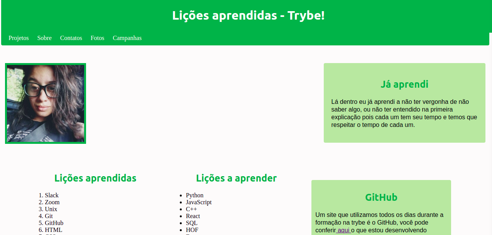

# Meu primeiro portifolio com html

#### Realização em: 27/08/2020

Aqui você ira encontrar um repositório com o meu primeiro projeto feito inteiramente em HTML e CSS.

### Elementos que compõem a pagina:

 * `Tag <header />`
 * `Tag <nav />`
 * `Tag <a />`
 * `Tag <aside />`
 * `Tag 
`
 * `Tag <h1 />`
 * `Tag <h2 />`
 * `Tag 
`
 * `Tag `
 * `Tag <ol />`
 * `Tag <ul />`
 * `Tag <article />`
 * `Tag <section />`
 * `Tag <table />`
 * `Tag <footer />`

Você pode ver a pagina completa no link: [Melissa-gomes.github.io](https://Melissa-gomes.github.io)